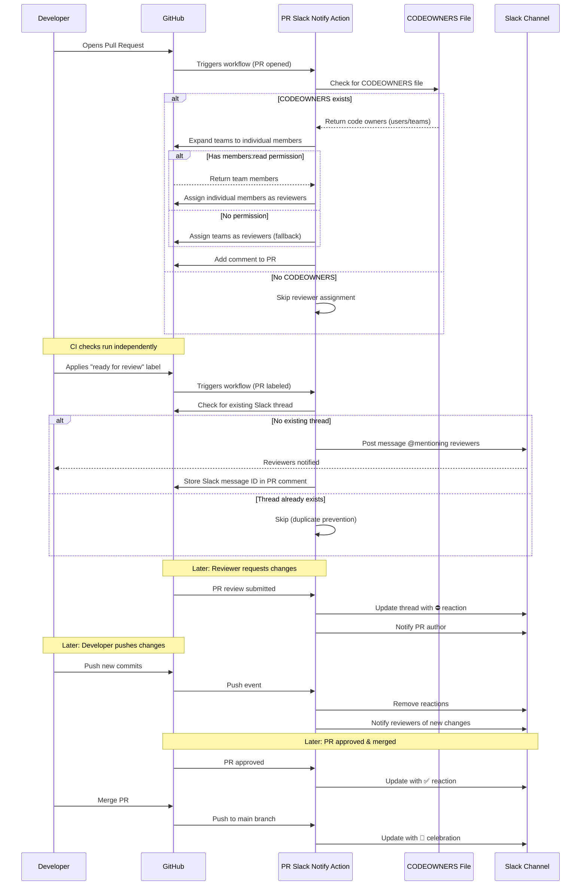

# PR Reviewer Slack Notify Action

This action posts a message to a Slack channel @ing the requested reviewers when a configured label is applied to a PR. Reviewers are automatically assigned from CODEOWNERS when the PR is opened, and the Slack notification is sent as soon as the trigger label is added — no polling or waiting for CI checks. This is easy to set up, but requires creating a Slack app with bot permissions.

## Setting up the Slack app

[Create a Slack App](https://api.slack.com/apps) with `Bots` and `Permissions` functionality. It is worth noting that you will need administrator privileges for this, so hit up your IT team in advance. Once the app is created install it to your workspace and invite the bot to the channel you would messages posted to.

You will need to make sure that the bot has the correct minimum required scopes:

- `chat:write`
- `reactions:read`
- `reactions:write`

##### NOTE: previous versions of this action relied on `Incoming Webhooks`. In order to post to the message thread and have the bot update reactions, it is now required to provide this permissions

## AWS

This no longer accepts `slack-users` as an input. Instead this action expects you to have a JSON file stored somewhere in S3 that has this shape:

```json
{
  "engineers": [
    { "github_username": "myGithubHandle", "slack_id": "U123456789" }
  ]
}
```

This makes it much easier to manage using this action at scale where the same engineers are working in many repos. You will need to create an IAM user with permission to get this object from this particular bucket in S3.

## Adding the action to your project

In your `./github/workflows` directory, add a `slackNotify.yml` (or whatever the hell you want to call it) file. Add the following as contents:

```yml
name: PR Review Slack Notify
permissions:
  contents: read
  pull-requests: write
on:
  pull_request:
    types: [opened, ready_for_review, labeled]
  pull_request_review:
    types: [submitted, dismissed]
  push:
    branches:
      - main # Replace with your base branch

# IMPORTANT! in order for the aws sdk to auth correctly these keys/values need to be exposed here
env:
  AWS_ACCESS_KEY_ID: ${{ secrets.YOUR_AWS_ACCESS_KEY_ID }}
  AWS_SECRET_ACCESS_KEY: ${{ secrets.YOUR_AWS_SECRET_ACCESS_KEY }}

jobs:
  notify:
    runs-on: ubuntu-latest
    name: PR Review Slack Notify
    steps:
      - name: Send slack notifications to requested reviewers
        id: pr-slack-notify
        uses: mlg87/pr-reviewer-slack-notify-action@v10.0.0
        with:
          aws-region: "us-west-2"
          aws-s3-bucket: "my-bucket"
          aws-s3-object-key: "path/to/json/file/engineer-github-slack-mapping.json"
          base-branch: "staging"
          bot-token: ${{ secrets.SLACK_BOT_TOKEN }}
          channel-id: "[GET_THIS_FROM_SLACK]"
          github-token: ${{ secrets.GH_TOKEN }}
          label-for-initial-notification: "ready for review"
          verbose: false
```

## Action inputs

| Input                            | Description                                                                                                                                                      | Required | Type     | Default |
| -------------------------------- | ---------------------------------------------------------------------------------------------------------------------------------------------------------------- | -------- | -------- | ------- |
| `aws-region`                     | Region in which the Github <=> Slack engineer mapping JSON is stored                                                                                             | `true`   | `String` | n/a     |
| `aws-s3-bucket`                  | Bucket in which the Github <=> Slack engineer mapping JSON object is stored in S3                                                                                | `true`   | `String` | n/a     |
| `aws-s3-object-key`              | Name of the Github <=> Slack engineer mapping JSON object in S3                                                                                                  | `true`   | `String` | n/a     |
| `base-branch`                    | Branch name that your PRs will be opened in to.                                                                                                                  | `true`   | `String` | n/a     |
| `bot-token`                      | OAuth token from Slack. Find this on your Slack App's settings page under `OAuth & Permissions`.                                                                 | `true`   | `String` | n/a     |
| `channel-id`                     | The id of the channel you would like messages posted to. It is easiest to find this by opening your Slack workspace in the browser and grabbing it from the URL. | `true`   | `String` | n/a     |
| `github-token`                   | Personal access token generated by Github. Can be an individual user's or one generated for a bot. **Note**: For automatic CODEOWNERS team expansion, this token needs organization-level `members: read` permission. If not provided, teams will be assigned as reviewers instead of individual members. | `true`   | `String` | n/a     |
| `label-for-initial-notification` | The label that triggers initial Slack notifications when applied to the PR.                                                                                      | `true`   | `String` | n/a     |
| `label-name-to-watch-for`        | Optional label to watch for to notify thread of activity                                                                                                         | `false`  | `String` | `''`    |
| `ignore-draft-prs`               | Do not message on draft PRs                                                                                                                                      | `false`  | `String` | `false` |
| `silence-on-quiet-label`         | Do not message if the PR has the `quiet` label                                                                                                                   | `false`  | `String` | `false` |
| `fail-silently`                  | Allow action to fail silently to hide the red X of death                                                                                                         | `false`  | `String` | `false` |
| `verbose`                        | Optional feature to shorten the slack message. Verbose: true will post the PR body. Verbose: false will not.                                                     | `false`  | `String` | `true`  |

##### NOTE: It is recommended to store sensitive values (bot-token, AWS credentials) in GitHub Secrets

## How it Works (v10.0.0+)

**Label-Driven Notifications**: Starting with v10.0.0, this action uses a label-driven model. Instead of polling for CI checks to pass, notifications are sent immediately when a configured label is applied to the PR. This eliminates long-running workflow jobs and gives you explicit control over when reviewers are notified.

**Workflow**:

1. A PR is opened or marked as ready for review
2. The action automatically assigns reviewers from CODEOWNERS (if the file exists)
3. When the configured `label-for-initial-notification` label is applied to the PR, the action creates a Slack thread @mentioning the assigned reviewers
4. Subsequent events (reviews, pushes, merges) post updates to the existing Slack thread

## Automatic Reviewer Assignment (CODEOWNERS)

This action automatically assigns reviewers based on your repository's `CODEOWNERS` file when a PR is opened or marked as ready for review.

**How it works**:

1. When a PR is opened, the action looks for a `CODEOWNERS` file in:
   - `.github/CODEOWNERS`
   - `CODEOWNERS` (root of repository)
   - `docs/CODEOWNERS`

2. If found, it parses **all** code owners listed in the file (not just for changed files)

3. Expands GitHub teams to individual members (see permissions below)

4. Automatically assigns the individuals as reviewers

5. Skips the PR author if they're listed as a code owner

6. Posts a comment on the PR mentioning the assigned reviewers

**Required Permissions for Team Expansion**:

To expand GitHub teams to individual members, the `github-token` must have **organization-level** `members: read` permission. This is in addition to the repository permissions.

**If your token doesn't have `members: read` permission**:
- The action will still work, but teams will be assigned as reviewers instead of individual members
- A warning will be logged explaining the permission issue
- The Slack notification will mention the team (e.g., `@org/team-name`) instead of individual engineers

**To grant `members: read` permission**:
1. Go to your organization's settings
2. Navigate to "Personal access tokens" or "GitHub Apps"
3. Grant the token "Read access to organization members"

**Important Notes**:

- This feature is **optional** - if no CODEOWNERS file exists, the action continues normally
- The action will not fail if CODEOWNERS parsing fails or team expansion fails
- Reviewers can still be assigned manually before or after the action runs
- Both GitHub users (`@username`) and teams (`@org/team-name`) are supported
- If team expansion fails, teams are assigned as reviewers (fallback behavior)

## Migrating from v9.x to v10.0.0

**Breaking Changes**:

- `label-for-initial-notification` is now **required** (was optional)
- `polling-interval` and `polling-timeout` inputs have been **removed**
- Notifications are no longer delayed by CI check polling — they fire immediately when the label is applied
- `check_suite` and `workflow_run` triggers are no longer needed
- The `concurrency` group is no longer needed (no long-running polling jobs)
- `checks: read` permission is no longer needed
- The `SLACK_NOTIFICATION_STATE` PR comment tracking has been removed

**Workflow Updates Required**:

```diff
name: PR Review Slack Notify
permissions:
  contents: read
  pull-requests: write
- checks: read
on:
  pull_request:
-   types: [opened, ready_for_review, synchronize, labeled]
+   types: [opened, ready_for_review, labeled]
  pull_request_review:
    types: [submitted, dismissed]
  push:
    branches:
      - main
- check_suite:
-   types: [completed]
- workflow_run:
-   workflows: ["Your PR Checks Workflow Name"]
-   types: [completed]

-concurrency:
-  group: pr-slack-notify-${{ github.event.pull_request.number || github.event.number }}
-  cancel-in-progress: false

jobs:
  notify:
    runs-on: ubuntu-latest
    name: PR Review Slack Notify
-   timeout-minutes: 35
    steps:
      - name: Send slack notifications to requested reviewers
        id: pr-slack-notify
-       uses: mlg87/pr-reviewer-slack-notify-action@v9.0.0
+       uses: mlg87/pr-reviewer-slack-notify-action@v10.0.0
        with:
          # ... other inputs ...
+         label-for-initial-notification: "ready for review"
-         polling-interval: 90
-         polling-timeout: 30
```

## Action Flow (Sequence Diagram)



## PR Lifecycle Example

1. User opens PR (reviewers are automatically assigned from CODEOWNERS if the file exists).
1. When ready, a team member applies the configured label (e.g., "ready for review") to the PR.
1. The action posts a message in the provided Slack channel mentioning the requested reviewers with a link to the PR, the PR title, and the PR body (if verbose is enabled).
1. One of the reviewers requests changes to the PR, so the action adds the stop sign reaction to the original thread and mentions the PR author in a message in the thread that changes have been requested. The body (main comment associated with the review) is included in the message.
1. PR owner pushes up code changes, so action removes reactions from the thread and notifies the requested reviewers that there is new code and they should go check it out.
1. Someone approves! Action updates the reactions accordingly and notifies the PR owner.
1. The code gets merged into the `base-branch`, so action updates the thread and reactions.

[K, bye.](https://media.giphy.com/media/DfSLII45H40RW/giphy.gif)
